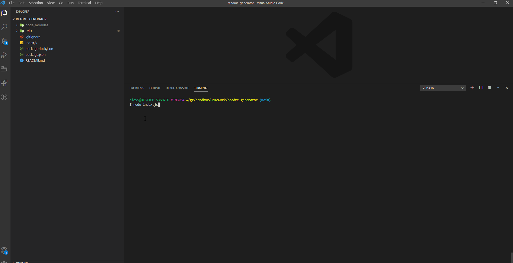
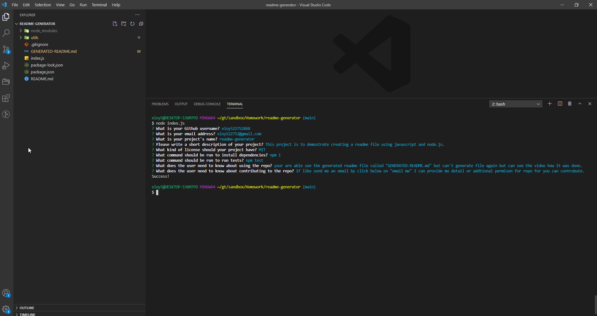
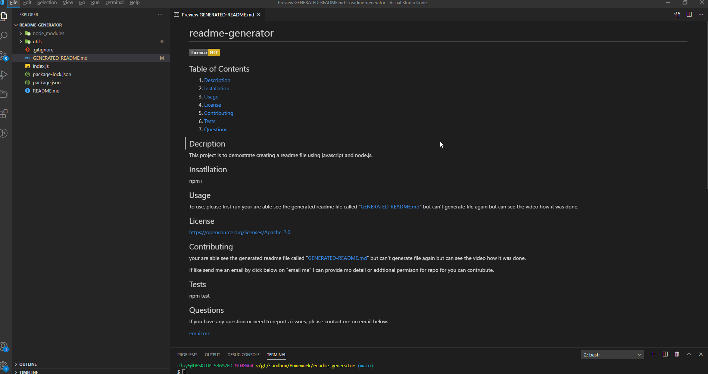

# readmegenerate
## Description
When creating an open source project on GitHub, it’s important to have a high-quality README for the app. This should include what the app is for, how to use the app, how to install it, how to report issues, and how to make contributions. In this project I demonstrate how to generate a professional README.md using javascript with node.js.

## Screenshots of readme generation & readme

### Start prompt input to generate file

### Ask questions regarding  information to generate readme

### Generated readme and preview

### Deployed Site Details

Link to readme file below:

[generated readme file](https://github.com/eloy522752868/readme-generator/blob/main/GENERATED-README.md/)

[Video Instructions](https://drive.google.com/file/d/1Qo90qcj_WMJxnJUmMJ9uOOahUE5-_XEo/view?usp=sharing/)

